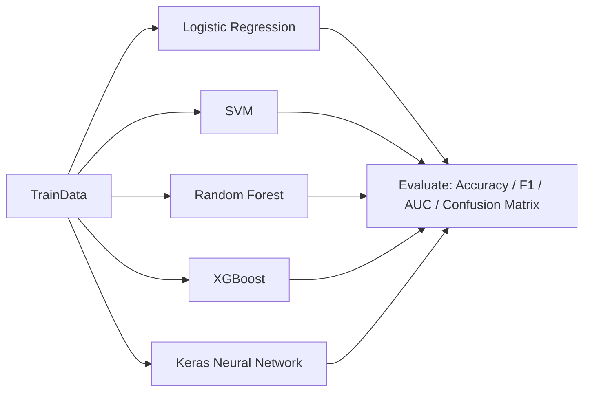

# <div align="center">Credit card fraud detection </div>
<div align="center"></div>


## Overview:
Our objective is to create the classifier for credit card fraud detection. To do it, we'll compare classification models from different methods :

- Logistic regression
- Support Vector Machine
- Bagging (Random Forest)
- Boosting (XGBoost)
- Neural Network (tensorflow/keras)
## Dataset:
[Credit Card Fraud Detection](https://www.kaggle.com/mlg-ulb/creditcardfraud)

The datasets contains transactions made by credit cards in September 2013 by european cardholders. This dataset presents transactions that occurred in two days, where we have 492 frauds out of 284,807 transactions. The dataset is highly unbalanced, the positive class (frauds) account for 0.172% of all transactions. I decided to proceed to an undersampling strategy to re-balance the class.

It contains only numerical input variables which are the result of a PCA transformation. Unfortunately, due to confidentiality issues, we cannot provide the original features and more background information about the data.<br>
## Implementation:

**Libraries:**  `NumPy` `pandas` `pylab` `matplotlib` `sklearn` `seaborn` `plotly` `tensorflow` `keras` `imblearn`
## Data Exploration:
Only 492 (or 0.172%) of transaction are fraudulent. That means the data is highly unbalanced with respect with target variable Class.<br>

<br>
The dataset is highly imbalanced ! It's a big problem because classifiers will always predict the most common class without performing any analysis of the features and it will have a high accuracy rate, obviously not the correct one. To change that, I will proceed to random undersampling.

The simplest undersampling technique involves randomly selecting examples from the majority class and deleting them from the training dataset. This is referred to as random undersampling.

Although simple and effective, a limitation of this technique is that examples are removed without any concern for how useful or important they might be in determining the decision boundary between the classes. This means it is possible, or even likely, that useful information will be deleted.<br>


<br>
For undersampling, we can use the package imblearn with RandomUnderSampler function. <br>

```
import imblearn
from imblearn.under_sampling import RandomUnderSampler 
undersample = RandomUnderSampler(sampling_strategy=0.5)
```


## Machine Learning Model Evaluation and Prediction:
### Logistic Regression:
  
```
Accuracy : 0.94
F1 score : 0.92
AUC : 0.96
```

### Support Vector Machine:
  
```
Accuracy : 0.94
F1 score : 0.92
AUC : 0.97
```


# Credit Card Fraud Detection

<div align="center">
	
</div>

## Table of contents
- Overview
- Dataset
- Project structure
- Data pipeline (with Mermaid diagrams)
- Models and Neural Network architecture (with Mermaid)
- Training & Evaluation
- Results summary
- How to reproduce (installation & usage on Windows PowerShell)
- Notes, limitations & next steps
- About the author

---

## Overview
This project explores credit card fraud detection using multiple classifiers and a neural network. The goal is to build a reliable binary classifier to detect fraudulent transactions in a heavily imbalanced dataset and compare approaches including Logistic Regression, SVM, Random Forest, XGBoost and Keras-based Neural Networks.

Key ideas covered:
- Handling imbalanced datasets (undersampling strategy)
- Feature scaling and preprocessing
- Model training, cross-validation and evaluation with metrics (Accuracy, F1, AUC)
- Neural network architecture and training with callbacks

## Dataset
Dataset: "Credit Card Fraud Detection" (Kaggle)
- Transactions from September 2013 (European cardholders)
- 284,807 transactions, 492 frauds (~0.172% positive class)
- Features: PCA-transformed numerical features (V1..V28), plus `Time`, `Amount`, `Class` (target)

Because the dataset is extremely imbalanced, the repository used random undersampling of the majority class to rebalance the training set before modeling. The README below documents the pipeline and how the models were trained and evaluated.

## Project structure (what to expect)
Typical files you may find in this workspace:

- `Credit Card Fraud Detection Using Neural Networks.ipynb` — main notebook with EDA, preprocessing, models and experiments
- `output/` — figures and images used by the notebook / README
- `README.md` — this file

## High-level pipeline
This flow explains the end-to-end steps from raw CSV to model evaluation.

```mermaid
flowchart LR
	A[Raw CSV transactions.csv] --> B[Exploration & EDA]
	B --> C[Preprocessing]
	C --> D[Sampling (undersample majority)]
	D --> E[Train/Test Split]
	E --> F[Modeling]
	F --> G[Evaluation & Comparison]
	G --> H[Save Best Model & Visuals]
```

Notes:
- Preprocessing includes scaling `Amount`, optional `Time` binning, and using PCA features as provided.
- Undersampling is performed with imblearn.RandomUnderSampler(sampling_strategy=0.5) in the referenced notebook.

## Data preprocessing (detailed)

```mermaid
flowchart TB
	subgraph PREP [Preprocessing]
		P1[Load CSV] --> P2[Drop / handle nulls]
		P2 --> P3[Scale `Amount` (StandardScaler)]
		P3 --> P4[Optional: add derived features]
		P4 --> P5[Apply RandomUnderSampler(sampling_strategy=0.5)]
	end
```

Important contract for preprocessing (inputs/outputs/error modes):
- Input: raw DataFrame with columns [Time, V1..V28, Amount, Class]
- Output: X (features), y (binary target) with balanced class ratio per sampling_strategy
- Errors: missing columns or corrupted CSV should fail early with clear message

Edge cases considered:
- Empty or truncated CSV -> raise informative error
- All-zero `Amount` or skewed distribution -> still scaled
- Very small undersampled dataset -> validate minimum examples for training

## Models implemented
- Logistic Regression
- Support Vector Machine
- Random Forest (Bagging)
- XGBoost (Boosting)
- Multi-Layer Perceptron (sklearn MLPClassifier)
- Neural Network with Keras (TensorFlow backend)

### Model comparison flow



## Neural network architecture (used in the notebook)
The notebook's Keras model (one example) has the following structure:

```python
model = Sequential()
model.add(Dense(32, input_shape=(29,), activation='relu'))
model.add(Dropout(0.2))
model.add(Dense(16, activation='relu'))
model.add(Dropout(0.2))
model.add(Dense(8, activation='relu'))
model.add(Dropout(0.2))
model.add(Dense(4, activation='relu'))
model.add(Dropout(0.2))
model.add(Dense(1, activation='sigmoid'))

opt = tf.keras.optimizers.Adam(learning_rate=0.001)
model.compile(optimizer=opt, loss='binary_crossentropy', metrics=['accuracy'])
```

Mermaid diagram for the same architecture:

```mermaid
flowchart LR
	Input[Input vector (29 dims)] --> D1[Dense 32 ReLU]\n  D1 --> DO1[Dropout 0.2]\n  DO1 --> D2[Dense 16 ReLU]\n  D2 --> DO2[Dropout 0.2]\n  DO2 --> D3[Dense 8 ReLU]\n+  D3 --> DO3[Dropout 0.2]\n+  DO3 --> D4[Dense 4 ReLU]\n+  D4 --> DO4[Dropout 0.2]\n+  DO4 --> Out[Dense 1 Sigmoid]
```

Notes on training:
- EarlyStopping callback used (monitor='val_accuracy', patience=15) to avoid overfitting.
- Example training parameters from notebook: epochs=6, batch_size=5, validation_split=0.15 (these can be adjusted)

## Training & Evaluation
Evaluation metrics used across models: Accuracy, F1 score, AUC (ROC). Because of class imbalance, F1 and AUC are emphasized more than raw accuracy.

Confusion matrix and ROC curves are plotted in the notebook for visual comparison.

## Results summary (numbers from the notebook)
- Logistic Regression
	- Accuracy: 0.94
	- F1 score: 0.92
	- AUC: 0.96
- Support Vector Machine
	- Accuracy: 0.94
	- F1 score: 0.92
	- AUC: 0.97
- Random Forest
	- Accuracy: 0.95
	- F1 score: 0.93
	- AUC: 0.97
- XGBoost
	- Accuracy: 0.95
	- F1 score: 0.93
	- AUC: 0.97
- Neural Network (Keras)
	- Accuracy: 0.95
	- F1 score: 0.94
	- AUC: 0.98

These results were obtained after undersampling and training as shown in the notebook. They provide a baseline comparison — further hyperparameter tuning, cross-validation, and more robust sampling strategies (SMOTE, ensemble balancing) could change results.

## How to reproduce (Windows PowerShell)
Below are minimal steps to reproduce locally. The notebook contains the full pipeline; this section shows how to set up the environment and run the notebook.

1) Create a virtual environment (recommended):

```powershell
python -m venv .venv; .\.venv\Scripts\Activate.ps1
```

2) Install required packages (example pip list). You can create a `requirements.txt` containing core dependencies like:

```text
pandas
numpy
matplotlib
seaborn
scikit-learn
imbalanced-learn
tensorflow
xgboost
plotly
```

Then install:

```powershell
pip install -r requirements.txt
```

3) Place the Kaggle `creditcard.csv` in the notebook's working directory (or update the notebook path). If you don't have it, get it here: https://www.kaggle.com/mlg-ulb/creditcardfraud

4) Open and run the notebook (uses Jupyter):

```powershell
jupyter notebook "Credit Card Fraud Detection Using Neural Networks.ipynb"
```

5) The notebook cells run the EDA, preprocessing (undersampling), model training and evaluation. Figures are saved to `output/`.

## Notes, limitations & next steps
- Limitation: random undersampling can discard informative majority-class samples. Consider SMOTE, ADASYN, or ensemble/thresholding techniques.
- Limitation: models are trained on a dataset that has PCA'ed features (no interpretability for original features).
- Next steps:
	- Add stratified k-fold CV and report averaged metrics with confidence intervals
	- Hyperparameter search (GridSearchCV / RandomizedSearchCV) for the best models
	- Try hybrid sampling (undersample + SMOTE)
	- Export the best model and add a small inference script / REST API wrapper

## Quick troubleshooting
- If you see memory or GPU issues with TensorFlow, set `tf.config.set_visible_devices([], 'GPU')` to force CPU during debugging.
- If plotting fails in headless environments, save figures to files (the notebook already writes to `output/`).

---

## About the author
Hi, I'm Arpit — an AI enthusiast and data science / ML practitioner. This project demonstrates classification strategies on an imbalanced dataset and compares classical ML with neural networks.

---

If you'd like, I can also:
- add a `requirements.txt` or `environment.yml` file
- create a small reproducible script to train the best model from CSV
- add automated tests that validate preprocessing steps

Tell me which of those you'd like next and I'll add them.
